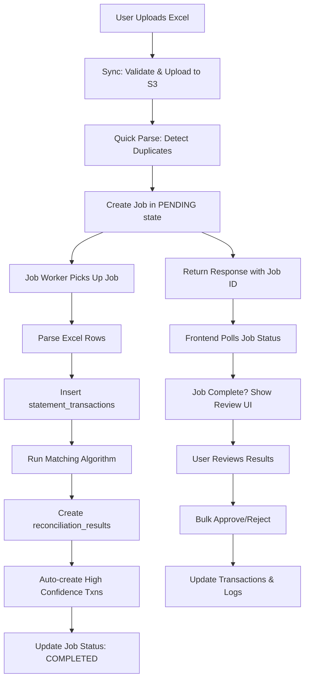
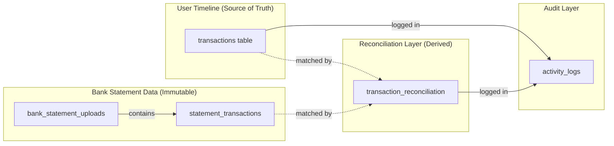
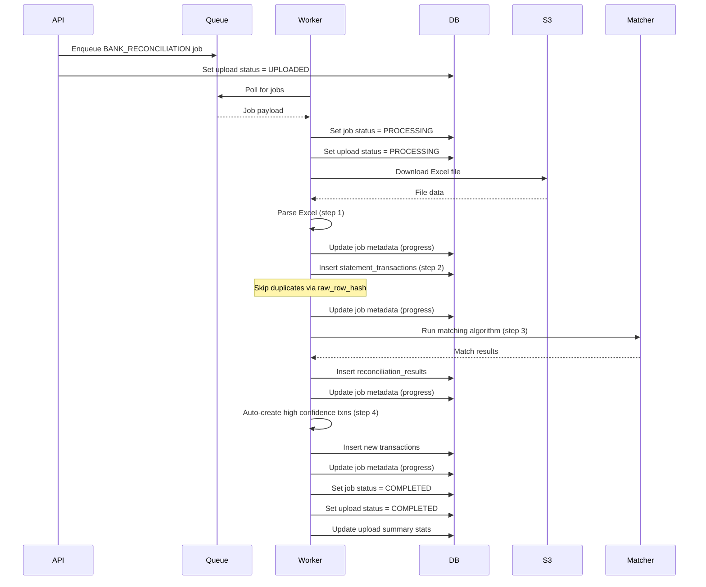
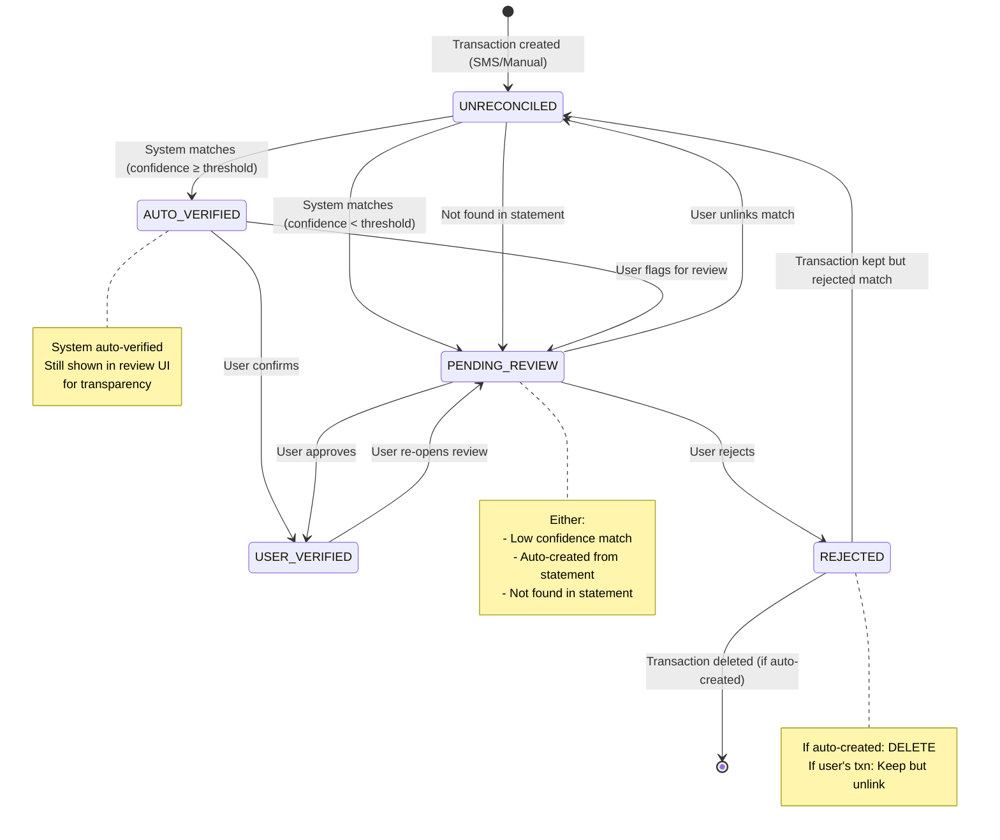
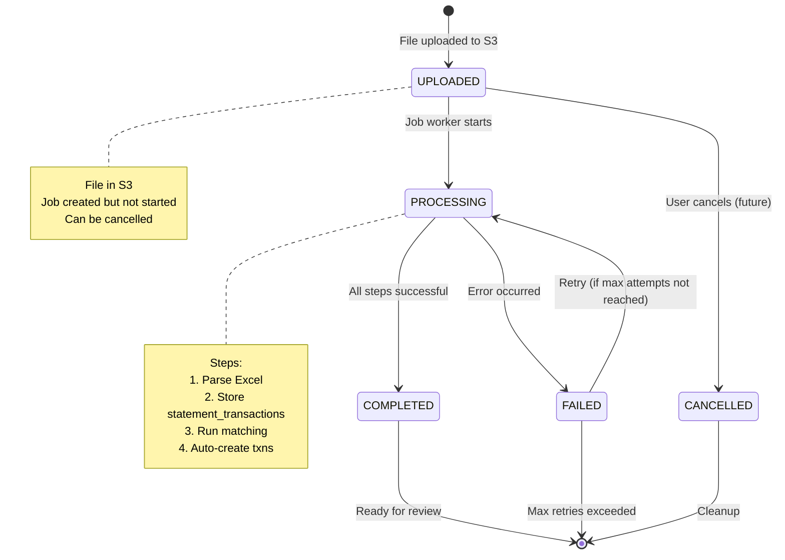
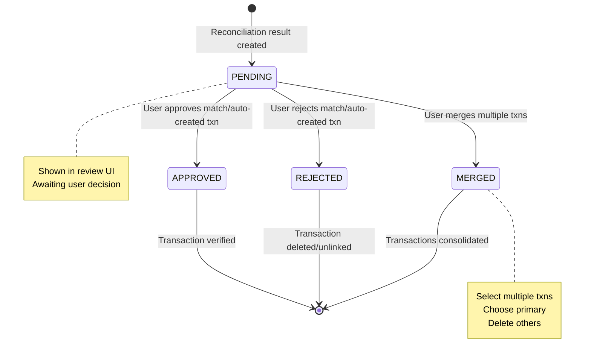
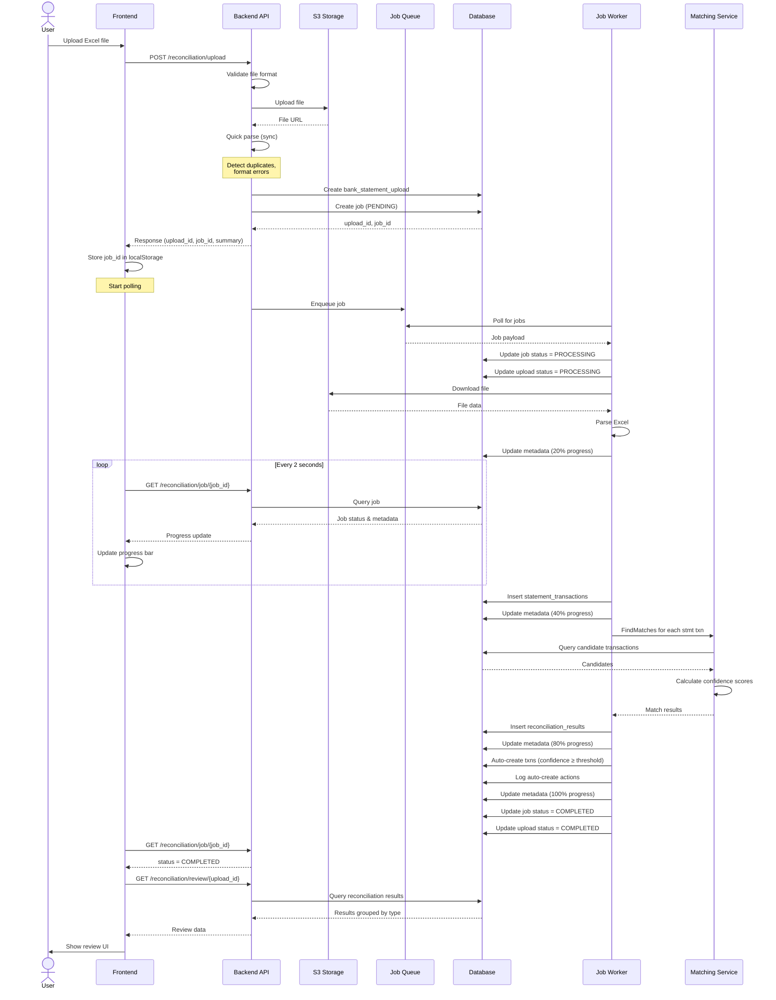
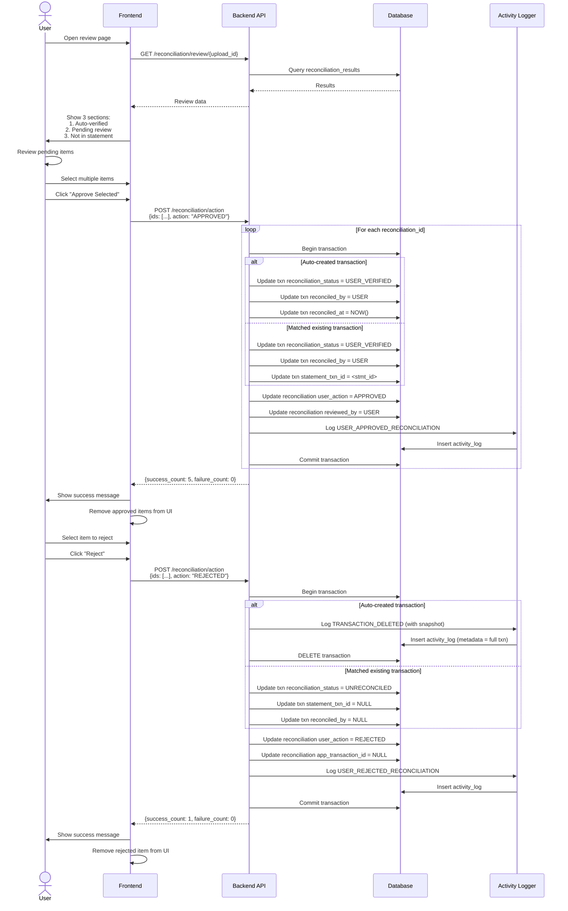
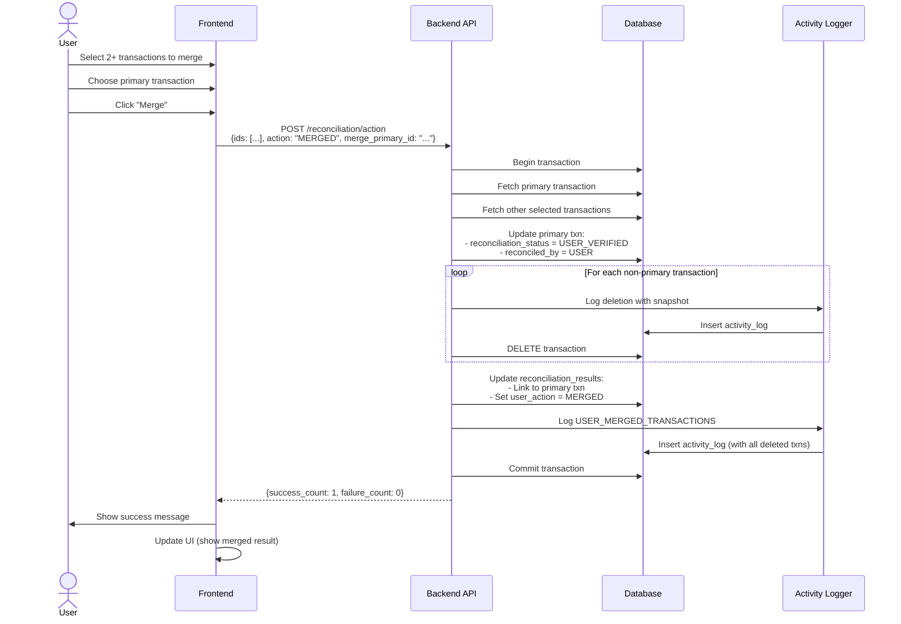

# Bank Statement Reconciliation - Implementation Plan

## Table of Contents
1. [Overview](#overview)
2. [Architecture](#architecture)
3. [Database Schema Changes](#database-schema-changes)
4. [Data Structures](#data-structures)
5. [API Specifications](#api-specifications)
6. [Job Architecture](#job-architecture)
7. [Matching Algorithm Interface](#matching-algorithm-interface)
8. [Activity Logging](#activity-logging)
9. [State Machines](#state-machines)
10. [Sequence Diagrams](#sequence-diagrams)
11. [Implementation Phases](#implementation-phases)

---

## Overview

### Problem Statement
Users track expenses daily via **SMS parsing** and **manual entry**. Later, users upload a **bank statement (Excel)** to **verify** tracked transactions, **identify missing transactions**, and **flag discrepancies**.

### Core Principles
- **Non-destructive**: Never silently delete user data
- **Explainable**: All automated decisions are logged and reviewable
- **Confidence-based**: System auto-merges high confidence, flags low confidence for review
- **Async by design**: Large Excel files processed in background jobs
- **User control**: Final authority on all reconciliation decisions

### Key Features
- Upload Excel bank statements
- Automatic duplicate detection (prevent re-upload processing)
- Confidence-based transaction matching
- Auto-create missing transactions from statement
- Review UI with bulk approve/reject
- Complete audit trail in activity logs
- Configurable confidence threshold per user

---

## Architecture

### High-Level System Flow



### Data Flow Layers



---

## Database Schema Changes

### 1. Add Reconciliation Enums

```sql
-- Migration: 008_add_reconciliation_enums.sql

-- +goose Up
CREATE TYPE transaction_source AS ENUM (
    'SMS',
    'MANUAL',
    'STATEMENT_AUTO'
);

CREATE TYPE transaction_reconciliation_status AS ENUM (
    'UNRECONCILED',      -- Default: Not yet reconciled
    'AUTO_VERIFIED',     -- System auto-matched (high confidence)
    'PENDING_REVIEW',    -- Low confidence or auto-created, needs user review
    'USER_VERIFIED',     -- User manually approved/merged
    'REJECTED'           -- User rejected (soft deleted)
);

CREATE TYPE reconciliation_actor AS ENUM (
    'SYSTEM',
    'USER'
);

CREATE TYPE upload_processing_status AS ENUM (
    'UPLOADED',          -- File in S3, job created but not started
    'PROCESSING',        -- Job is running
    'COMPLETED',         -- Job finished successfully
    'FAILED',            -- Job failed with errors
    'CANCELLED'          -- User cancelled (future feature)
);

CREATE TYPE reconciliation_result_type AS ENUM (
    'HIGH_CONFIDENCE_MATCH',   -- Found app txn with confidence ≥ threshold
    'LOW_CONFIDENCE_MATCH',    -- Found app txn with confidence < threshold
    'MISSING_IN_APP',          -- No app txn found (auto-created or flagged)
    'NOT_IN_STATEMENT',        -- App txn not found in bank statement
    'MANUALLY_MATCHED',        -- User manually linked
    'CASH_TRANSACTION'         -- Skipped from matching (is_cash=true)
);

-- +goose Down
DROP TYPE IF EXISTS reconciliation_result_type;
DROP TYPE IF EXISTS upload_processing_status;
DROP TYPE IF EXISTS reconciliation_actor;
DROP TYPE IF EXISTS transaction_reconciliation_status;
DROP TYPE IF EXISTS transaction_source;
```

### 2. Update Transactions Table

```sql
-- Migration: 009_update_transactions_for_reconciliation.sql

-- +goose Up
ALTER TABLE transactions
    ADD COLUMN source transaction_source DEFAULT 'MANUAL',
    ADD COLUMN reconciliation_status transaction_reconciliation_status DEFAULT 'UNRECONCILED',
    ADD COLUMN reconciled_by reconciliation_actor,
    ADD COLUMN reconciled_at TIMESTAMP,
    ADD COLUMN statement_txn_id UUID REFERENCES statement_transactions(id);

-- Index for reconciliation queries
CREATE INDEX idx_transactions_reconciliation_status ON transactions(reconciliation_status);
CREATE INDEX idx_transactions_source ON transactions(source);
CREATE INDEX idx_transactions_statement_txn_id ON transactions(statement_txn_id);

-- +goose Down
DROP INDEX IF EXISTS idx_transactions_statement_txn_id;
DROP INDEX IF EXISTS idx_transactions_source;
DROP INDEX IF EXISTS idx_transactions_reconciliation_status;

ALTER TABLE transactions
    DROP COLUMN IF EXISTS statement_txn_id,
    DROP COLUMN IF EXISTS reconciled_at,
    DROP COLUMN IF EXISTS reconciled_by,
    DROP COLUMN IF EXISTS reconciliation_status,
    DROP COLUMN IF EXISTS source;
```

### 3. Update Users Table

```sql
-- Migration: 010_add_user_reconciliation_settings.sql

-- +goose Up
ALTER TABLE users
    ADD COLUMN reconciliation_threshold INT DEFAULT 70 CHECK (reconciliation_threshold >= 0 AND reconciliation_threshold <= 100);

COMMENT ON COLUMN users.reconciliation_threshold IS 'Confidence threshold (0-100) for auto-verification. Default: 70';

-- +goose Down
ALTER TABLE users
    DROP COLUMN IF EXISTS reconciliation_threshold;
```

### 4. Update Statement Transactions Table

```sql
-- Migration: 011_update_statement_transactions.sql

-- +goose Up
ALTER TABLE statement_transactions
    ADD COLUMN raw_row_hash VARCHAR(64) NOT NULL,
    ADD COLUMN row_number INT NOT NULL,
    ADD COLUMN is_duplicate BOOLEAN DEFAULT false;

-- Unique constraint to prevent duplicate rows within same upload
CREATE UNIQUE INDEX idx_statement_transactions_unique_hash
    ON statement_transactions(upload_id, raw_row_hash);

-- Index for duplicate detection queries
CREATE INDEX idx_statement_transactions_hash ON statement_transactions(raw_row_hash);
CREATE INDEX idx_statement_transactions_upload_id ON statement_transactions(upload_id);

COMMENT ON COLUMN statement_transactions.raw_row_hash IS 'SHA256 hash of (date + amount + description + reference_number + row_position) for duplicate detection';
COMMENT ON COLUMN statement_transactions.row_number IS 'Original position in Excel file (1-based)';

-- +goose Down
DROP INDEX IF EXISTS idx_statement_transactions_upload_id;
DROP INDEX IF EXISTS idx_statement_transactions_hash;
DROP INDEX IF EXISTS idx_statement_transactions_unique_hash;

ALTER TABLE statement_transactions
    DROP COLUMN IF EXISTS is_duplicate,
    DROP COLUMN IF EXISTS row_number,
    DROP COLUMN IF EXISTS raw_row_hash;
```

### 5. Update Bank Statement Uploads Table

```sql
-- Migration: 012_update_bank_statement_uploads.sql

-- +goose Up
ALTER TABLE bank_statement_uploads
    ADD COLUMN processing_status upload_processing_status DEFAULT 'UPLOADED',
    ADD COLUMN duplicate_rows INT DEFAULT 0,
    ADD COLUMN error_rows INT DEFAULT 0,
    ADD COLUMN valid_rows INT DEFAULT 0,
    ADD COLUMN parsing_errors JSONB,
    ADD COLUMN job_id UUID REFERENCES jobs(id);

-- Index for status queries
CREATE INDEX idx_bank_statement_uploads_status ON bank_statement_uploads(processing_status);
CREATE INDEX idx_bank_statement_uploads_job_id ON bank_statement_uploads(job_id);

COMMENT ON COLUMN bank_statement_uploads.processing_status IS 'Current processing state of the upload';
COMMENT ON COLUMN bank_statement_uploads.parsing_errors IS 'Array of parsing errors: [{"row": 23, "error": "Invalid date", "data": {...}}]';

-- +goose Down
DROP INDEX IF EXISTS idx_bank_statement_uploads_job_id;
DROP INDEX IF EXISTS idx_bank_statement_uploads_status;

ALTER TABLE bank_statement_uploads
    DROP COLUMN IF EXISTS job_id,
    DROP COLUMN IF EXISTS parsing_errors,
    DROP COLUMN IF EXISTS valid_rows,
    DROP COLUMN IF EXISTS error_rows,
    DROP COLUMN IF EXISTS duplicate_rows,
    DROP COLUMN IF EXISTS processing_status;
```

### 6. Update Transaction Reconciliation Table

```sql
-- Migration: 013_update_transaction_reconciliation.sql

-- +goose Up
ALTER TABLE transaction_reconciliation
    ADD COLUMN result_type reconciliation_result_type NOT NULL DEFAULT 'HIGH_CONFIDENCE_MATCH',
    ADD COLUMN match_signals JSONB,
    ADD COLUMN auto_created_txn_id UUID REFERENCES transactions(id),
    ADD COLUMN reviewed_by reconciliation_actor,
    ADD COLUMN reviewed_at TIMESTAMP;

-- Rename existing columns for clarity
ALTER TABLE transaction_reconciliation
    RENAME COLUMN reconciliation_status TO match_status;

-- Index for review queries
CREATE INDEX idx_transaction_reconciliation_result_type ON transaction_reconciliation(result_type);
CREATE INDEX idx_transaction_reconciliation_user_action ON transaction_reconciliation(user_action);
CREATE INDEX idx_transaction_reconciliation_upload_id ON transaction_reconciliation(upload_id);

COMMENT ON COLUMN transaction_reconciliation.result_type IS 'Type of reconciliation result';
COMMENT ON COLUMN transaction_reconciliation.match_signals IS 'JSON object explaining why match occurred: {"date_match": true, "amount_match": true, "description_similarity": 0.85}';
COMMENT ON COLUMN transaction_reconciliation.auto_created_txn_id IS 'Reference to transaction auto-created from this statement txn';

-- +goose Down
DROP INDEX IF EXISTS idx_transaction_reconciliation_upload_id;
DROP INDEX IF EXISTS idx_transaction_reconciliation_user_action;
DROP INDEX IF EXISTS idx_transaction_reconciliation_result_type;

ALTER TABLE transaction_reconciliation
    RENAME COLUMN match_status TO reconciliation_status;

ALTER TABLE transaction_reconciliation
    DROP COLUMN IF EXISTS reviewed_at,
    DROP COLUMN IF EXISTS reviewed_by,
    DROP COLUMN IF EXISTS auto_created_txn_id,
    DROP COLUMN IF EXISTS match_signals,
    DROP COLUMN IF EXISTS result_type;
```

---

## Data Structures

### Go Enums

```go
// File: internal/domain/reconciliation/types.go

package reconciliation

// TransactionSource represents where a transaction originated
type TransactionSource string

const (
    SourceSMS           TransactionSource = "SMS"
    SourceManual        TransactionSource = "MANUAL"
    SourceStatementAuto TransactionSource = "STATEMENT_AUTO"
)

// TransactionReconciliationStatus represents the reconciliation state
type TransactionReconciliationStatus string

const (
    StatusUnreconciled   TransactionReconciliationStatus = "UNRECONCILED"
    StatusAutoVerified   TransactionReconciliationStatus = "AUTO_VERIFIED"
    StatusPendingReview  TransactionReconciliationStatus = "PENDING_REVIEW"
    StatusUserVerified   TransactionReconciliationStatus = "USER_VERIFIED"
    StatusRejected       TransactionReconciliationStatus = "REJECTED"
)

// ReconciliationActor represents who made the reconciliation decision
type ReconciliationActor string

const (
    ActorSystem ReconciliationActor = "SYSTEM"
    ActorUser   ReconciliationActor = "USER"
)

// UploadProcessingStatus represents the processing state of an upload
type UploadProcessingStatus string

const (
    UploadStatusUploaded   UploadProcessingStatus = "UPLOADED"
    UploadStatusProcessing UploadProcessingStatus = "PROCESSING"
    UploadStatusCompleted  UploadProcessingStatus = "COMPLETED"
    UploadStatusFailed     UploadProcessingStatus = "FAILED"
    UploadStatusCancelled  UploadProcessingStatus = "CANCELLED"
)

// ReconciliationResultType represents the type of reconciliation result
type ReconciliationResultType string

const (
    ResultHighConfidenceMatch ReconciliationResultType = "HIGH_CONFIDENCE_MATCH"
    ResultLowConfidenceMatch  ReconciliationResultType = "LOW_CONFIDENCE_MATCH"
    ResultMissingInApp        ReconciliationResultType = "MISSING_IN_APP"
    ResultNotInStatement      ReconciliationResultType = "NOT_IN_STATEMENT"
    ResultManuallyMatched     ReconciliationResultType = "MANUALLY_MATCHED"
    ResultCashTransaction     ReconciliationResultType = "CASH_TRANSACTION"
)

// UserAction represents user's decision on a reconciliation result
type UserAction string

const (
    ActionPending  UserAction = "PENDING"
    ActionApproved UserAction = "APPROVED"
    ActionRejected UserAction = "REJECTED"
    ActionMerged   UserAction = "MERGED"
)
```

### DTOs

```go
// File: internal/domain/reconciliation/dto.go

package reconciliation

import (
    "time"
    "github.com/google/uuid"
)

// UploadStatementRequest - Request to upload bank statement
type UploadStatementRequest struct {
    AccountID             uuid.UUID `json:"account_id" binding:"required"`
    StatementPeriodStart  time.Time `json:"statement_period_start" binding:"required"`
    StatementPeriodEnd    time.Time `json:"statement_period_end" binding:"required"`
    // File is handled via multipart form
}

// UploadStatementResponse - Immediate response after upload
type UploadStatementResponse struct {
    UploadID  uuid.UUID               `json:"upload_id"`
    JobID     uuid.UUID               `json:"job_id"`
    Status    UploadProcessingStatus  `json:"status"`
    Summary   UploadSummary           `json:"summary"`
}

// UploadSummary - Quick summary from sync validation
type UploadSummary struct {
    TotalRows     int                  `json:"total_rows"`
    DuplicateRows int                  `json:"duplicate_rows"`
    ErrorRows     int                  `json:"error_rows"`
    ValidRows     int                  `json:"valid_rows"`
    Errors        []ParseError         `json:"errors,omitempty"`
}

// ParseError - Error found during parsing
type ParseError struct {
    Row   int                    `json:"row"`
    Error string                 `json:"error"`
    Data  map[string]interface{} `json:"data,omitempty"`
}

// JobStatusResponse - Response for job status polling
type JobStatusResponse struct {
    JobID     uuid.UUID              `json:"job_id"`
    UploadID  uuid.UUID              `json:"upload_id"`
    Status    UploadProcessingStatus `json:"status"`
    Progress  *JobProgress           `json:"progress,omitempty"`
    Error     string                 `json:"error,omitempty"`
}

// JobProgress - Progress information stored in job metadata
type JobProgress struct {
    TotalRows       int    `json:"total_rows"`
    ProcessedRows   int    `json:"processed_rows"`
    CurrentStep     string `json:"current_step"`
    PercentComplete int    `json:"percent_complete"`
}

// ReconciliationReviewResponse - Data for review UI
type ReconciliationReviewResponse struct {
    UploadID       uuid.UUID                  `json:"upload_id"`
    AccountID      uuid.UUID                  `json:"account_id"`
    PeriodStart    time.Time                  `json:"period_start"`
    PeriodEnd      time.Time                  `json:"period_end"`
    Summary        ReconciliationSummary      `json:"summary"`
    AutoVerified   []ReconciliationItem       `json:"auto_verified"`
    PendingReview  []ReconciliationItem       `json:"pending_review"`
    NotInStatement []ReconciliationItem       `json:"not_in_statement"`
}

// ReconciliationSummary - Summary statistics
type ReconciliationSummary struct {
    TotalStatementTxns int `json:"total_statement_txns"`
    AutoVerified       int `json:"auto_verified"`
    PendingReview      int `json:"pending_review"`
    NotInStatement     int `json:"not_in_statement"`
    Rejected           int `json:"rejected"`
}

// ReconciliationItem - Single reconciliation result for UI
type ReconciliationItem struct {
    ReconciliationID  uuid.UUID                    `json:"reconciliation_id"`
    ResultType        ReconciliationResultType     `json:"result_type"`
    ConfidenceScore   float64                      `json:"confidence_score,omitempty"`
    StatementTxn      *StatementTransactionDTO     `json:"statement_txn,omitempty"`
    AppTxn            *TransactionDTO              `json:"app_txn,omitempty"`
    MatchSignals      map[string]interface{}       `json:"match_signals,omitempty"`
    UserAction        UserAction                   `json:"user_action"`
}

// StatementTransactionDTO - Statement transaction for review UI
type StatementTransactionDTO struct {
    ID              uuid.UUID  `json:"id"`
    Date            time.Time  `json:"date"`
    Description     string     `json:"description"`
    Amount          float64    `json:"amount"`
    Type            string     `json:"type"`
    ReferenceNumber string     `json:"reference_number,omitempty"`
    Balance         *float64   `json:"balance,omitempty"`
}

// TransactionDTO - App transaction for review UI
type TransactionDTO struct {
    ID                   uuid.UUID                         `json:"id"`
    AccountID            uuid.UUID                         `json:"account_id"`
    Date                 time.Time                         `json:"date"`
    Amount               float64                           `json:"amount"`
    Type                 string                            `json:"type"`
    Description          string                            `json:"description,omitempty"`
    CategoryID           *uuid.UUID                        `json:"category_id,omitempty"`
    Source               TransactionSource                 `json:"source"`
    ReconciliationStatus TransactionReconciliationStatus   `json:"reconciliation_status"`
}

// BulkReconciliationActionRequest - Bulk approve/reject/merge
type BulkReconciliationActionRequest struct {
    ReconciliationIDs []uuid.UUID `json:"reconciliation_ids" binding:"required,min=1"`
    Action            UserAction  `json:"action" binding:"required,oneof=APPROVED REJECTED MERGED"`
    MergePrimaryID    *uuid.UUID  `json:"merge_primary_id,omitempty"` // For MERGED action
}

// BulkReconciliationActionResponse - Response for bulk action
type BulkReconciliationActionResponse struct {
    SuccessCount int         `json:"success_count"`
    FailureCount int         `json:"failure_count"`
    Errors       []BulkError `json:"errors,omitempty"`
}

// BulkError - Error for individual item in bulk operation
type BulkError struct {
    ReconciliationID uuid.UUID `json:"reconciliation_id"`
    Error            string    `json:"error"`
}
```

### Job Payload Structure

```go
// File: internal/domain/reconciliation/job_payload.go

package reconciliation

import (
    "time"
    "github.com/google/uuid"
)

// ReconciliationJobPayload - Payload for BANK_RECONCILIATION job
type ReconciliationJobPayload struct {
    UploadID             uuid.UUID `json:"upload_id"`
    UserID               string    `json:"user_id"`
    AccountID            uuid.UUID `json:"account_id"`
    FileURL              string    `json:"file_url"`
    StatementPeriodStart time.Time `json:"statement_period_start"`
    StatementPeriodEnd   time.Time `json:"statement_period_end"`
}

// ReconciliationJobMetadata - Metadata stored in job.metadata during processing
type ReconciliationJobMetadata struct {
    TotalRows       int                  `json:"total_rows"`
    ProcessedRows   int                  `json:"processed_rows"`
    CurrentStep     string               `json:"current_step"`
    PercentComplete int                  `json:"percent_complete"`
    StepProgress    map[string]StepStats `json:"step_progress"`
    StartedAt       time.Time            `json:"started_at"`
    LastUpdatedAt   time.Time            `json:"last_updated_at"`
}

// StepStats - Statistics for each processing step
type StepStats struct {
    Name      string    `json:"name"`
    Started   time.Time `json:"started"`
    Completed time.Time `json:"completed,omitempty"`
    Count     int       `json:"count"`
    Errors    int       `json:"errors,omitempty"`
}

// ReconciliationJobResult - Result stored in job.result upon completion
type ReconciliationJobResult struct {
    Success            bool                   `json:"success"`
    TotalRows          int                    `json:"total_rows"`
    DuplicateRows      int                    `json:"duplicate_rows"`
    InsertedRows       int                    `json:"inserted_rows"`
    MatchedTxns        int                    `json:"matched_txns"`
    AutoCreatedTxns    int                    `json:"auto_created_txns"`
    PendingReviewCount int                    `json:"pending_review_count"`
    Errors             []string               `json:"errors,omitempty"`
    ProcessingTime     float64                `json:"processing_time_seconds"`
    CompletedAt        time.Time              `json:"completed_at"`
}
```

---

## API Specifications

### 1. Upload Bank Statement

**Endpoint:** `POST /api/v1/reconciliation/upload`

**Authentication:** Required (user must own the account)

**Request:**
- Content-Type: `multipart/form-data`
- Fields:
  - `file`: Excel file (.xlsx, .xls, .csv)
  - `account_id`: UUID
  - `statement_period_start`: Date (YYYY-MM-DD)
  - `statement_period_end`: Date (YYYY-MM-DD)

**Response:** `200 OK`
```json
{
  "upload_id": "550e8400-e29b-41d4-a716-446655440000",
  "job_id": "7c9e6679-7425-40de-944b-e07fc1f90ae7",
  "status": "UPLOADED",
  "summary": {
    "total_rows": 500,
    "duplicate_rows": 15,
    "error_rows": 3,
    "valid_rows": 482,
    "errors": [
      {
        "row": 23,
        "error": "Invalid date format",
        "data": {
          "date": "2024-13-45",
          "amount": "500.00"
        }
      },
      {
        "row": 45,
        "error": "Missing amount",
        "data": {
          "date": "2024-01-15",
          "description": "ATM Withdrawal"
        }
      }
    ]
  }
}
```

**Error Responses:**
- `400 Bad Request`: Invalid file format, missing required fields
- `404 Not Found`: Account not found
- `403 Forbidden`: User doesn't own the account
- `413 Payload Too Large`: File exceeds size limit (e.g., 10MB)

---

### 2. Get Job Status

**Endpoint:** `GET /api/v1/reconciliation/job/{job_id}`

**Authentication:** Required

**Response:** `200 OK`
```json
{
  "job_id": "7c9e6679-7425-40de-944b-e07fc1f90ae7",
  "upload_id": "550e8400-e29b-41d4-a716-446655440000",
  "status": "PROCESSING",
  "progress": {
    "total_rows": 482,
    "processed_rows": 250,
    "current_step": "matching_transactions",
    "percent_complete": 52
  }
}
```

**Status States:**
- `UPLOADED`: Job created, not started yet
- `PROCESSING`: Job is running
- `COMPLETED`: Job finished successfully
- `FAILED`: Job failed with errors

**When COMPLETED:**
```json
{
  "job_id": "7c9e6679-7425-40de-944b-e07fc1f90ae7",
  "upload_id": "550e8400-e29b-41d4-a716-446655440000",
  "status": "COMPLETED",
  "progress": {
    "total_rows": 482,
    "processed_rows": 482,
    "current_step": "completed",
    "percent_complete": 100
  }
}
```

**When FAILED:**
```json
{
  "job_id": "7c9e6679-7425-40de-944b-e07fc1f90ae7",
  "upload_id": "550e8400-e29b-41d4-a716-446655440000",
  "status": "FAILED",
  "error": "Failed to parse Excel file: corrupted workbook"
}
```

---

### 3. Get Reconciliation Review

**Endpoint:** `GET /api/v1/reconciliation/review/{upload_id}`

**Authentication:** Required

**Response:** `200 OK`
```json
{
  "upload_id": "550e8400-e29b-41d4-a716-446655440000",
  "account_id": "a1b2c3d4-e5f6-4a5b-8c9d-0e1f2a3b4c5d",
  "period_start": "2024-01-01T00:00:00Z",
  "period_end": "2024-01-31T23:59:59Z",
  "summary": {
    "total_statement_txns": 482,
    "auto_verified": 420,
    "pending_review": 52,
    "not_in_statement": 10,
    "rejected": 0
  },
  "auto_verified": [
    {
      "reconciliation_id": "rec-uuid-1",
      "result_type": "HIGH_CONFIDENCE_MATCH",
      "confidence_score": 95.5,
      "statement_txn": {
        "id": "stmt-uuid-1",
        "date": "2024-01-15T00:00:00Z",
        "description": "STARBUCKS COFFEE",
        "amount": 250.00,
        "type": "DEBIT",
        "reference_number": "REF12345"
      },
      "app_txn": {
        "id": "txn-uuid-1",
        "account_id": "a1b2c3d4-e5f6-4a5b-8c9d-0e1f2a3b4c5d",
        "date": "2024-01-15T10:30:00Z",
        "amount": 250.00,
        "type": "EXPENSE",
        "description": "Coffee at Starbucks",
        "source": "SMS",
        "reconciliation_status": "AUTO_VERIFIED"
      },
      "match_signals": {
        "date_match": true,
        "amount_match": true,
        "description_similarity": 0.85,
        "same_day": true
      },
      "user_action": "PENDING"
    }
  ],
  "pending_review": [
    {
      "reconciliation_id": "rec-uuid-2",
      "result_type": "LOW_CONFIDENCE_MATCH",
      "confidence_score": 65.0,
      "statement_txn": {
        "id": "stmt-uuid-2",
        "date": "2024-01-16T00:00:00Z",
        "description": "AMAZON PURCHASE",
        "amount": 1200.00,
        "type": "DEBIT"
      },
      "app_txn": {
        "id": "txn-uuid-2",
        "account_id": "a1b2c3d4-e5f6-4a5b-8c9d-0e1f2a3b4c5d",
        "date": "2024-01-14T00:00:00Z",
        "amount": 1200.00,
        "type": "EXPENSE",
        "description": "Online shopping",
        "source": "MANUAL",
        "reconciliation_status": "PENDING_REVIEW"
      },
      "match_signals": {
        "date_match": false,
        "date_difference_days": 2,
        "amount_match": true,
        "description_similarity": 0.45
      },
      "user_action": "PENDING"
    },
    {
      "reconciliation_id": "rec-uuid-3",
      "result_type": "MISSING_IN_APP",
      "confidence_score": null,
      "statement_txn": {
        "id": "stmt-uuid-3",
        "date": "2024-01-20T00:00:00Z",
        "description": "ATM WITHDRAWAL",
        "amount": 5000.00,
        "type": "DEBIT"
      },
      "app_txn": {
        "id": "txn-uuid-auto-1",
        "account_id": "a1b2c3d4-e5f6-4a5b-8c9d-0e1f2a3b4c5d",
        "date": "2024-01-20T00:00:00Z",
        "amount": 5000.00,
        "type": "EXPENSE",
        "description": "ATM WITHDRAWAL",
        "source": "STATEMENT_AUTO",
        "reconciliation_status": "PENDING_REVIEW"
      },
      "match_signals": null,
      "user_action": "PENDING"
    }
  ],
  "not_in_statement": [
    {
      "reconciliation_id": "rec-uuid-4",
      "result_type": "NOT_IN_STATEMENT",
      "confidence_score": null,
      "statement_txn": null,
      "app_txn": {
        "id": "txn-uuid-3",
        "account_id": "a1b2c3d4-e5f6-4a5b-8c9d-0e1f2a3b4c5d",
        "date": "2024-01-25T00:00:00Z",
        "amount": 100.00,
        "type": "EXPENSE",
        "description": "Pending UPI payment",
        "source": "SMS",
        "reconciliation_status": "UNRECONCILED"
      },
      "match_signals": null,
      "user_action": "PENDING"
    }
  ]
}
```

---

### 4. Bulk Reconciliation Action

**Endpoint:** `POST /api/v1/reconciliation/action`

**Authentication:** Required

**Request:**
```json
{
  "reconciliation_ids": [
    "rec-uuid-1",
    "rec-uuid-2",
    "rec-uuid-3"
  ],
  "action": "APPROVED"
}
```

**Action Types:**
- `APPROVED`: Approve the reconciliation (marks transactions as USER_VERIFIED)
- `REJECTED`: Reject the reconciliation (soft deletes auto-created txns, unlinks matches)
- `MERGED`: Merge multiple transactions into one (requires `merge_primary_id`)

**For MERGED action:**
```json
{
  "reconciliation_ids": [
    "rec-uuid-5",
    "rec-uuid-6"
  ],
  "action": "MERGED",
  "merge_primary_id": "txn-uuid-primary"
}
```

**Response:** `200 OK`
```json
{
  "success_count": 3,
  "failure_count": 0,
  "errors": []
}
```

**With Errors:**
```json
{
  "success_count": 2,
  "failure_count": 1,
  "errors": [
    {
      "reconciliation_id": "rec-uuid-2",
      "error": "Transaction already reconciled by another statement"
    }
  ]
}
```

---

### 5. List Uploads

**Endpoint:** `GET /api/v1/reconciliation/uploads`

**Authentication:** Required

**Query Parameters:**
- `account_id` (optional): Filter by account
- `status` (optional): Filter by processing status
- `limit` (optional, default: 20): Max results
- `offset` (optional, default: 0): Pagination offset

**Response:** `200 OK`
```json
{
  "uploads": [
    {
      "upload_id": "550e8400-e29b-41d4-a716-446655440000",
      "account_id": "a1b2c3d4-e5f6-4a5b-8c9d-0e1f2a3b4c5d",
      "file_name": "statement_jan_2024.xlsx",
      "statement_period_start": "2024-01-01T00:00:00Z",
      "statement_period_end": "2024-01-31T23:59:59Z",
      "processing_status": "COMPLETED",
      "total_transactions_found": 482,
      "matched_transactions": 420,
      "unmatched_transactions": 52,
      "missing_transactions": 10,
      "created_at": "2024-01-15T14:30:00Z",
      "processing_completed_at": "2024-01-15T14:32:15Z"
    }
  ],
  "total": 1,
  "limit": 20,
  "offset": 0
}
```

---

## Job Architecture

### Job Worker Flow



### Job Steps Breakdown

**Step 1: Parse Excel (20% weight)**
```go
func (w *ReconciliationWorker) parseExcel(ctx context.Context, fileURL string) ([]ExcelRow, error) {
    // Download from S3
    // Parse Excel using excelize library
    // Validate each row
    // Generate raw_row_hash for each row
    // Return parsed rows
}
```

**Step 2: Store Statement Transactions (20% weight)**
```go
func (w *ReconciliationWorker) storeStatementTransactions(ctx context.Context, rows []ExcelRow, uploadID uuid.UUID) error {
    // Batch insert statement_transactions
    // Use ON CONFLICT (upload_id, raw_row_hash) DO NOTHING for deduplication
    // Track duplicate count
    // Update job metadata with progress
}
```

**Step 3: Run Matching Algorithm (40% weight)**
```go
func (w *ReconciliationWorker) matchTransactions(ctx context.Context, uploadID uuid.UUID) error {
    // Fetch all statement_transactions for this upload
    // Fetch candidate app transactions (same account, date range ±7 days)
    // Exclude cash transactions (is_cash = true)
    // For each statement txn:
    //   - Call matcher.FindMatches()
    //   - Calculate confidence score
    //   - Create reconciliation_result
    // Update job metadata with progress
}
```

**Step 4: Auto-create Transactions (20% weight)**
```go
func (w *ReconciliationWorker) autoCreateTransactions(ctx context.Context, uploadID uuid.UUID, userThreshold int) error {
    // Fetch reconciliation_results where:
    //   - result_type = MISSING_IN_APP
    //   - confidence_score >= userThreshold (or no match found)
    // For each result:
    //   - Create new transaction with source = STATEMENT_AUTO
    //   - Set reconciliation_status = PENDING_REVIEW (for user approval)
    //   - Link to reconciliation_result
    // Update job metadata with progress
}
```

### Job Metadata Updates

```go
// Example metadata updates during processing

// Initial state
{
  "total_rows": 482,
  "processed_rows": 0,
  "current_step": "parsing",
  "percent_complete": 0,
  "step_progress": {},
  "started_at": "2024-01-15T14:30:00Z",
  "last_updated_at": "2024-01-15T14:30:00Z"
}

// After parsing (20% complete)
{
  "total_rows": 482,
  "processed_rows": 482,
  "current_step": "storing",
  "percent_complete": 20,
  "step_progress": {
    "parsing": {
      "name": "Parsing Excel",
      "started": "2024-01-15T14:30:00Z",
      "completed": "2024-01-15T14:30:45Z",
      "count": 482,
      "errors": 0
    }
  },
  "last_updated_at": "2024-01-15T14:30:45Z"
}

// After storing (40% complete)
{
  "total_rows": 482,
  "processed_rows": 482,
  "current_step": "matching",
  "percent_complete": 40,
  "step_progress": {
    "parsing": { /* ... */ },
    "storing": {
      "name": "Storing Transactions",
      "started": "2024-01-15T14:30:45Z",
      "completed": "2024-01-15T14:31:15Z",
      "count": 467,
      "errors": 0
    }
  },
  "last_updated_at": "2024-01-15T14:31:15Z"
}

// After matching (80% complete)
{
  "total_rows": 482,
  "processed_rows": 482,
  "current_step": "auto_creating",
  "percent_complete": 80,
  "step_progress": {
    "parsing": { /* ... */ },
    "storing": { /* ... */ },
    "matching": {
      "name": "Matching Transactions",
      "started": "2024-01-15T14:31:15Z",
      "completed": "2024-01-15T14:32:00Z",
      "count": 467,
      "errors": 0
    }
  },
  "last_updated_at": "2024-01-15T14:32:00Z"
}

// Completed (100%)
{
  "total_rows": 482,
  "processed_rows": 482,
  "current_step": "completed",
  "percent_complete": 100,
  "step_progress": {
    "parsing": { /* ... */ },
    "storing": { /* ... */ },
    "matching": { /* ... */ },
    "auto_creating": {
      "name": "Auto-creating Transactions",
      "started": "2024-01-15T14:32:00Z",
      "completed": "2024-01-15T14:32:15Z",
      "count": 10,
      "errors": 0
    }
  },
  "last_updated_at": "2024-01-15T14:32:15Z"
}
```

### Error Handling & Retry

**Retry Strategy:**
```go
// In jobs table
max_attempts = 3
timeout_seconds = 600  // 10 minutes

// Retry on:
// - Temporary S3 failures
// - Database deadlocks
// - Network timeouts

// Don't retry on:
// - Invalid file format
// - Corrupted Excel
// - Missing account
// - User not found
```

**Partial Failure Handling:**
- If parsing fails on row 250 of 500, log error rows in `bank_statement_uploads.parsing_errors`
- Continue processing valid rows
- Mark job as COMPLETED with warnings
- User sees errors in review UI

---

## Matching Algorithm Interface

### Service Interface

```go
// File: internal/domain/reconciliation/matcher.go

package reconciliation

import (
    "context"
    "github.com/google/uuid"
)

// MatcherService defines the interface for transaction matching
type MatcherService interface {
    // FindMatches finds potential app transactions for a statement transaction
    FindMatches(ctx context.Context, req MatchRequest) ([]Match, error)

    // CalculateConfidence calculates confidence score for a single match
    CalculateConfidence(stmt StatementTransaction, app Transaction) (float64, MatchSignals, error)
}

// MatchRequest - Input for matching
type MatchRequest struct {
    StatementTxn  StatementTransaction
    AccountID     uuid.UUID
    UserID        string
    DateTolerance int // Days before/after to search
}

// Match - A potential match between statement and app transaction
type Match struct {
    AppTransaction  Transaction
    ConfidenceScore float64
    MatchSignals    MatchSignals
}

// MatchSignals - Explanation of why/how match occurred
type MatchSignals struct {
    DateMatch             bool    `json:"date_match"`
    DateDifferenceDays    int     `json:"date_difference_days,omitempty"`
    AmountMatch           bool    `json:"amount_match"`
    AmountDifference      float64 `json:"amount_difference,omitempty"`
    TypeMatch             bool    `json:"type_match"`
    DescriptionSimilarity float64 `json:"description_similarity,omitempty"`
    ReferenceNumberMatch  bool    `json:"reference_number_match,omitempty"`
    SameDay               bool    `json:"same_day"`

    // Scoring breakdown
    DateScore        int `json:"date_score"`
    AmountScore      int `json:"amount_score"`
    DescriptionScore int `json:"description_score"`
    ReferenceScore   int `json:"reference_score"`
    TotalScore       int `json:"total_score"`
}
```

### Matching Algorithm Pseudocode

```go
// Simplified matching logic (actual implementation later)

func (m *DefaultMatcher) FindMatches(ctx context.Context, req MatchRequest) ([]Match, error) {
    // Step 1: Query candidate transactions
    candidates := m.queryRepo.FindCandidateTransactions(ctx, CandidateQuery{
        AccountID: req.AccountID,
        DateFrom:  req.StatementTxn.Date.AddDate(0, 0, -req.DateTolerance),
        DateTo:    req.StatementTxn.Date.AddDate(0, 0, req.DateTolerance),
        Type:      req.StatementTxn.Type,
        IsCash:    false, // Exclude cash transactions
        ReconciliationStatus: []string{"UNRECONCILED"}, // Only unreconciled
    })

    var matches []Match

    // Step 2: Calculate confidence for each candidate
    for _, candidate := range candidates {
        confidence, signals := m.CalculateConfidence(req.StatementTxn, candidate)

        if confidence > 0 { // Only return if there's some match
            matches = append(matches, Match{
                AppTransaction:  candidate,
                ConfidenceScore: confidence,
                MatchSignals:    signals,
            })
        }
    }

    // Step 3: Sort by confidence (highest first)
    sort.Slice(matches, func(i, j int) bool {
        return matches[i].ConfidenceScore > matches[j].ConfidenceScore
    })

    // Step 4: Return top matches (e.g., top 3)
    if len(matches) > 3 {
        matches = matches[:3]
    }

    return matches, nil
}

func (m *DefaultMatcher) CalculateConfidence(stmt StatementTransaction, app Transaction) (float64, MatchSignals) {
    signals := MatchSignals{}

    // Date matching (max 40 points)
    daysDiff := abs(stmt.Date.Sub(app.Date).Hours() / 24)
    if daysDiff == 0 {
        signals.DateScore = 40
        signals.DateMatch = true
        signals.SameDay = true
    } else if daysDiff <= 1 {
        signals.DateScore = 30
    } else if daysDiff <= 3 {
        signals.DateScore = 20
    } else if daysDiff <= 7 {
        signals.DateScore = 10
    }
    signals.DateDifferenceDays = int(daysDiff)

    // Amount matching (max 35 points)
    amountDiff := abs(stmt.Amount - app.Amount)
    amountDiffPercent := (amountDiff / stmt.Amount) * 100
    if amountDiff == 0 {
        signals.AmountScore = 35
        signals.AmountMatch = true
    } else if amountDiffPercent <= 2 {
        signals.AmountScore = 25
    } else if amountDiffPercent <= 5 {
        signals.AmountScore = 15
    }
    signals.AmountDifference = amountDiff

    // Description similarity (max 15 points)
    // Use Levenshtein distance or fuzzy matching
    similarity := calculateStringSimilarity(stmt.Description, app.Description)
    signals.DescriptionSimilarity = similarity
    if similarity >= 0.8 {
        signals.DescriptionScore = 15
    } else if similarity >= 0.6 {
        signals.DescriptionScore = 10
    } else if similarity >= 0.4 {
        signals.DescriptionScore = 5
    }

    // Reference number matching (max 10 points)
    if stmt.ReferenceNumber != "" && app.ReferenceNumber != "" {
        if stmt.ReferenceNumber == app.ReferenceNumber {
            signals.ReferenceScore = 10
            signals.ReferenceNumberMatch = true
        }
    }

    // Type matching (implicit, candidates already filtered by type)
    signals.TypeMatch = stmt.Type == app.Type

    // Total score (max 100)
    signals.TotalScore = signals.DateScore + signals.AmountScore + signals.DescriptionScore + signals.ReferenceScore

    confidence := float64(signals.TotalScore)

    return confidence, signals
}
```

### Matching Configuration

```go
// Matching algorithm can be configured per implementation
type MatcherConfig struct {
    DateToleranceDays   int     // Default: 7
    AmountTolerancePercent float64 // Default: 2.0
    MinConfidenceScore  int     // Default: 30
    MaxCandidates       int     // Default: 3
    EnableFuzzyMatching bool    // Default: true
}
```

---

## Activity Logging

### Log Structure

All reconciliation actions are logged to `activity_logs` table with structured metadata.

### Action Types

```go
// File: internal/domain/reconciliation/activity_types.go

const (
    ActionUploadStatement        = "UPLOAD_BANK_STATEMENT"
    ActionReconciliationComplete = "RECONCILIATION_COMPLETE"
    ActionTransactionAutoCreated = "TRANSACTION_AUTO_CREATED"
    ActionTransactionMatched     = "TRANSACTION_MATCHED"
    ActionUserApproved           = "USER_APPROVED_RECONCILIATION"
    ActionUserRejected           = "USER_REJECTED_RECONCILIATION"
    ActionUserMerged             = "USER_MERGED_TRANSACTIONS"
    ActionTransactionDeleted     = "TRANSACTION_DELETED"
)
```

### Metadata Schemas

**Upload Statement:**
```json
{
  "action": "UPLOAD_BANK_STATEMENT",
  "entity_type": "bank_statement_upload",
  "entity_id": "upload-uuid",
  "user_id": "clerk-user-id",
  "metadata": {
    "account_id": "account-uuid",
    "file_name": "statement_jan_2024.xlsx",
    "period_start": "2024-01-01",
    "period_end": "2024-01-31",
    "file_size_bytes": 125000,
    "total_rows": 482
  }
}
```

**Reconciliation Complete:**
```json
{
  "action": "RECONCILIATION_COMPLETE",
  "entity_type": "bank_statement_upload",
  "entity_id": "upload-uuid",
  "user_id": "clerk-user-id",
  "metadata": {
    "job_id": "job-uuid",
    "total_statement_txns": 482,
    "auto_verified": 420,
    "pending_review": 52,
    "not_in_statement": 10,
    "auto_created_count": 15,
    "processing_time_seconds": 135.5
  }
}
```

**Transaction Auto-Created:**
```json
{
  "action": "TRANSACTION_AUTO_CREATED",
  "entity_type": "transaction",
  "entity_id": "txn-uuid",
  "user_id": "clerk-user-id",
  "metadata": {
    "statement_txn_id": "stmt-uuid",
    "reconciliation_id": "rec-uuid",
    "upload_id": "upload-uuid",
    "confidence_score": null,
    "transaction_snapshot": {
      "date": "2024-01-20",
      "amount": 5000.00,
      "description": "ATM WITHDRAWAL",
      "type": "DEBIT"
    },
    "actor": "SYSTEM"
  }
}
```

**User Rejected:**
```json
{
  "action": "USER_REJECTED_RECONCILIATION",
  "entity_type": "transaction",
  "entity_id": "txn-uuid",
  "user_id": "clerk-user-id",
  "metadata": {
    "reconciliation_id": "rec-uuid",
    "statement_txn_id": "stmt-uuid",
    "result_type": "MISSING_IN_APP",
    "was_auto_created": true,
    "transaction_snapshot": {
      "id": "txn-uuid",
      "date": "2024-01-20",
      "amount": 5000.00,
      "description": "ATM WITHDRAWAL",
      "source": "STATEMENT_AUTO",
      "reconciliation_status": "PENDING_REVIEW"
    },
    "actor": "USER",
    "reason": "duplicate"
  }
}
```

**User Approved:**
```json
{
  "action": "USER_APPROVED_RECONCILIATION",
  "entity_type": "transaction",
  "entity_id": "txn-uuid",
  "user_id": "clerk-user-id",
  "metadata": {
    "reconciliation_id": "rec-uuid",
    "statement_txn_id": "stmt-uuid",
    "result_type": "LOW_CONFIDENCE_MATCH",
    "original_confidence": 65.0,
    "original_status": "PENDING_REVIEW",
    "new_status": "USER_VERIFIED",
    "actor": "USER"
  }
}
```

**User Merged:**
```json
{
  "action": "USER_MERGED_TRANSACTIONS",
  "entity_type": "transaction",
  "entity_id": "primary-txn-uuid",
  "user_id": "clerk-user-id",
  "metadata": {
    "merged_txn_ids": ["txn-uuid-1", "txn-uuid-2"],
    "reconciliation_ids": ["rec-uuid-1", "rec-uuid-2"],
    "statement_txn_id": "stmt-uuid",
    "primary_txn_snapshot": {
      "id": "primary-txn-uuid",
      "date": "2024-01-15",
      "amount": 1200.00,
      "description": "Amazon purchase"
    },
    "deleted_txns": [
      {
        "id": "txn-uuid-1",
        "date": "2024-01-15",
        "amount": 600.00
      },
      {
        "id": "txn-uuid-2",
        "date": "2024-01-15",
        "amount": 600.00
      }
    ],
    "actor": "USER"
  }
}
```

---

## State Machines

### Transaction Reconciliation Status State Machine



### Upload Processing State Machine



### User Action Flow



---

## Sequence Diagrams

### Upload & Reconciliation Flow



### User Review & Approval Flow



### Merge Flow



---

## Implementation Phases

### Phase 1: Database Schema & Migrations (Week 1)

**Tasks:**
1. Create migration files (008-013)
2. Add new enums
3. Update `transactions`, `users`, `statement_transactions`, `bank_statement_uploads`, `transaction_reconciliation` tables
4. Add indexes for performance
5. Test migrations (up/down)

**Deliverables:**
- [ ] All migration SQL files
- [ ] Migration tests
- [ ] Updated SQLC queries

---

### Phase 2: Core Data Structures (Week 1)

**Tasks:**
1. Create `internal/domain/reconciliation/types.go` with enums
2. Create `internal/domain/reconciliation/dto.go` with request/response DTOs
3. Create `internal/domain/reconciliation/job_payload.go`
4. Update existing transaction DTOs with new fields
5. Generate SQLC models

**Deliverables:**
- [ ] All Go type definitions
- [ ] DTOs for API requests/responses
- [ ] Job payload structures
- [ ] SQLC generated code

---

### Phase 3: Upload API & S3 Integration (Week 2)

**Tasks:**
1. Create upload endpoint `POST /api/v1/reconciliation/upload`
2. Implement file validation (format, size)
3. S3 upload integration
4. Quick parse for duplicate detection (raw_row_hash generation)
5. Create `bank_statement_upload` and `job` records
6. Return upload summary

**Deliverables:**
- [ ] Upload API endpoint
- [ ] S3 service integration
- [ ] Excel parser (basic validation)
- [ ] Duplicate detection logic
- [ ] API tests

---

### Phase 4: Job Worker Infrastructure (Week 2)

**Tasks:**
1. Create job worker for `BANK_RECONCILIATION` type
2. Implement job polling and locking mechanism
3. Implement progress tracking (metadata updates)
4. Error handling and retry logic
5. Job status API `GET /api/v1/reconciliation/job/{job_id}`

**Deliverables:**
- [ ] Job worker implementation
- [ ] Progress tracking system
- [ ] Job status API endpoint
- [ ] Error handling & retry
- [ ] Worker tests

---

### Phase 5: Excel Parsing & Statement Storage (Week 3)

**Tasks:**
1. Implement full Excel parsing (excelize library)
2. Generate `raw_row_hash` for each row
3. Insert `statement_transactions` with deduplication
4. Handle parsing errors (store in JSONB)
5. Update upload statistics

**Deliverables:**
- [ ] Excel parser service
- [ ] Hash generation logic
- [ ] Statement transaction repository
- [ ] Error collection and storage
- [ ] Parser tests

---

### Phase 6: Matching Algorithm (Week 3-4)

**Tasks:**
1. Create `MatcherService` interface
2. Implement candidate query (date range, type, exclude cash)
3. Implement confidence scoring algorithm
4. Implement match signals generation
5. Create `reconciliation_results` records
6. Unit tests for matching logic

**Deliverables:**
- [ ] Matcher service interface
- [ ] Default matcher implementation
- [ ] Confidence scoring algorithm
- [ ] Match signals generation
- [ ] Comprehensive unit tests

---

### Phase 7: Auto-Create Transactions (Week 4)

**Tasks:**
1. Query high-confidence MISSING_IN_APP results
2. Create transactions with `source = STATEMENT_AUTO`
3. Set `reconciliation_status = PENDING_REVIEW`
4. Link to `reconciliation_results`
5. Log auto-create actions in `activity_logs`

**Deliverables:**
- [ ] Auto-create transaction logic
- [ ] Activity logging integration
- [ ] Tests for auto-create flow

---

### Phase 8: Review API (Week 5)

**Tasks:**
1. Create `GET /api/v1/reconciliation/review/{upload_id}`
2. Query and group reconciliation results
3. Transform to review DTOs
4. Add filtering and sorting options
5. Performance optimization (eager loading, indexes)

**Deliverables:**
- [ ] Review API endpoint
- [ ] Data grouping logic
- [ ] DTO transformation
- [ ] Performance tests

---

### Phase 9: Bulk Actions API (Week 5)

**Tasks:**
1. Create `POST /api/v1/reconciliation/action`
2. Implement APPROVED action logic
3. Implement REJECTED action logic
4. Implement MERGED action logic
5. Transaction management (atomic operations)
6. Activity logging for all actions

**Deliverables:**
- [ ] Bulk action API endpoint
- [ ] Action handlers (approve/reject/merge)
- [ ] Transaction safety
- [ ] Activity logging
- [ ] Integration tests

---

### Phase 10: Activity Logging (Week 6)

**Tasks:**
1. Create activity logger service
2. Implement structured metadata schemas
3. Log all reconciliation actions
4. Create queries for audit trail
5. Add activity log viewer API (optional)

**Deliverables:**
- [ ] Activity logger service
- [ ] Metadata schemas
- [ ] Logging integration across all flows
- [ ] Audit trail queries

---

### Phase 11: Frontend Integration (Week 6-7)

**Tasks:**
1. Upload form with file picker
2. Job status polling component
3. Progress bar UI
4. Review UI with 3 sections (auto-verified, pending, not in statement)
5. Bulk selection and actions
6. Merge transaction modal
7. LocalStorage for pending uploads

**Deliverables:**
- [ ] Upload page
- [ ] Polling hook
- [ ] Review dashboard
- [ ] Action buttons (approve/reject/merge)
- [ ] Error handling UI

---

### Phase 12: Testing & Optimization (Week 8)

**Tasks:**
1. End-to-end tests
2. Load testing (large Excel files)
3. Performance optimization
4. Edge case testing
5. Documentation

**Deliverables:**
- [ ] E2E test suite
- [ ] Load test results
- [ ] Performance benchmarks
- [ ] Edge case test coverage
- [ ] API documentation

---

## Edge Cases & Considerations

### 1. Duplicate Upload Detection
- **Case:** User uploads same file twice
- **Handling:** `raw_row_hash` UNIQUE constraint prevents duplicate inserts, increment `duplicate_rows` count

### 2. Overlapping Statement Periods
- **Case:** Upload Jan 1-31, then upload Jan 15-Feb 15
- **Handling:** Second upload's Jan 15-31 rows will be marked as duplicates, only Feb 1-15 will be new

### 3. Date Mismatch (Transaction vs Settlement)
- **Case:** User swipes card on Jan 14, bank posts on Jan 16
- **Handling:** Date tolerance of ±7 days in matching, confidence score adjusted based on difference

### 4. Amount Variations
- **Case:** SMS says ₹100, statement shows ₹100.50 (fees)
- **Handling:** Amount tolerance of ±2%, confidence score reduced proportionally

### 5. Cash Transactions
- **Case:** User tracks cash in app, not in bank statement
- **Handling:** Excluded from matching via `is_cash = true` filter, marked as `CASH_TRANSACTION` result type

### 6. Pending Transactions
- **Case:** User creates pending transaction, bank settles days later
- **Handling:** Matching considers date range, low confidence match flagged for review

### 7. Refunds & Reversals
- **Case:** Original -₹500 (DEBIT), refund +₹500 (CREDIT)
- **Handling:** Treated as separate transactions, not matched (different types)

### 8. Split Transactions
- **Case:** Bank shows ₹1000, user split into ₹600 + ₹400
- **Handling:** No automatic handling, user can manually merge in review UI

### 9. Foreign Currency
- **Case:** Transaction in USD, converted to INR in statement
- **Handling:** Out of scope for v1, future enhancement

### 10. Cancelled Uploads
- **Case:** User navigates away during processing
- **Handling:** Job continues in background, result stored, shown when user returns

### 11. Job Failures
- **Case:** S3 timeout during parsing
- **Handling:** Retry up to 3 times, if still fails mark as FAILED with error message

### 12. Partial Parsing Failures
- **Case:** 480 rows valid, 20 rows have errors
- **Handling:** Process valid rows, store errors in `parsing_errors` JSONB, show warnings in UI

---

## Security Considerations

1. **File Upload Validation:**
   - Validate file type (only Excel/CSV)
   - Limit file size (10MB max)
   - Scan for malware (future)
   - Validate user owns the account

2. **Data Access Control:**
   - Users can only see their own uploads
   - API endpoints verify user ownership
   - Job worker validates user context

3. **Activity Logging:**
   - All actions logged with user_id
   - Sensitive data in metadata (use carefully)
   - Audit trail for compliance

4. **S3 Security:**
   - Pre-signed URLs with expiration
   - Private bucket access
   - Encryption at rest

---

## Performance Considerations

1. **Database Indexes:**
   - `idx_transactions_reconciliation_status`
   - `idx_statement_transactions_hash`
   - `idx_transaction_reconciliation_upload_id`

2. **Batch Processing:**
   - Insert statement_transactions in batches of 100
   - Process reconciliation in batches to avoid memory issues

3. **Query Optimization:**
   - Eager load related data for review API
   - Use window functions for grouping
   - Limit candidate queries to ±7 days

4. **Job Worker Scaling:**
   - Horizontal scaling (multiple workers)
   - Job locking prevents duplicate processing
   - Timeout handling prevents stuck jobs

---

## Future Enhancements

1. **Smart Categorization:**
   - Use matched statement description to suggest categories
   - ML-based category prediction

2. **Recurring Transaction Detection:**
   - Identify recurring patterns in statements
   - Auto-link to recurring_transactions table

3. **Multi-Currency Support:**
   - Handle forex transactions
   - Store exchange rates

4. **Bank Integration:**
   - Direct bank API integration (Plaid, Yodlee)
   - Real-time transaction sync

5. **Merchant Recognition:**
   - Auto-create merchants from statement descriptions
   - Fuzzy matching for merchant names

6. **Notification System:**
   - Email when reconciliation completes
   - Push notifications for large discrepancies

7. **Advanced Merging:**
   - Auto-suggest split transaction merges
   - Partial amount matching

8. **Export Capabilities:**
   - Export reconciliation report (PDF/Excel)
   - Audit trail export

---

## Summary

This plan provides a complete blueprint for implementing bank statement reconciliation with:

- ✅ **Non-destructive design**: User data never silently deleted
- ✅ **Async architecture**: Large files processed in background
- ✅ **Confidence-based automation**: Smart matching with user oversight
- ✅ **Complete audit trail**: All actions logged
- ✅ **Robust duplicate detection**: Hash-based deduplication
- ✅ **Flexible review UI**: Bulk actions and manual overrides
- ✅ **Scalable job system**: Retry, progress tracking, error handling

**Estimated Timeline:** 8 weeks for full implementation
**Team Size:** 2-3 engineers (1 backend, 1 frontend, 1 shared)

---

**Next Steps:**
1. Review and approve this plan
2. Set up project tracking (Jira/Linear)
3. Begin Phase 1 (Database migrations)
4. Iterate on matching algorithm design
5. Build and test incrementally

Let's build this! 🚀
